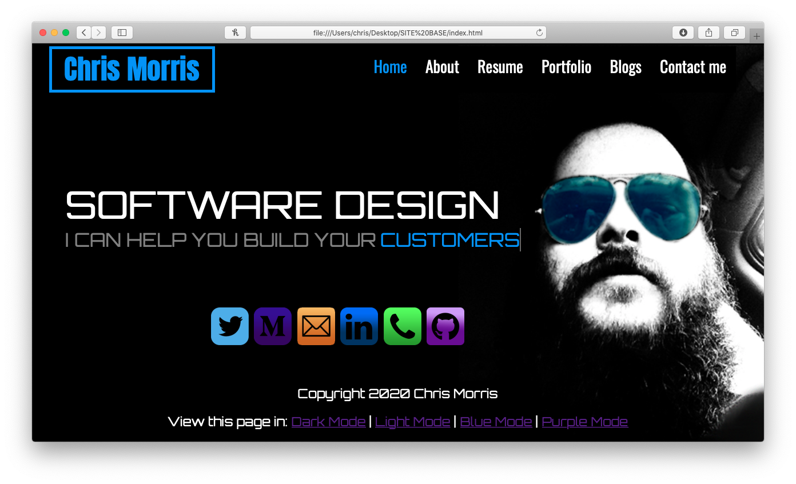
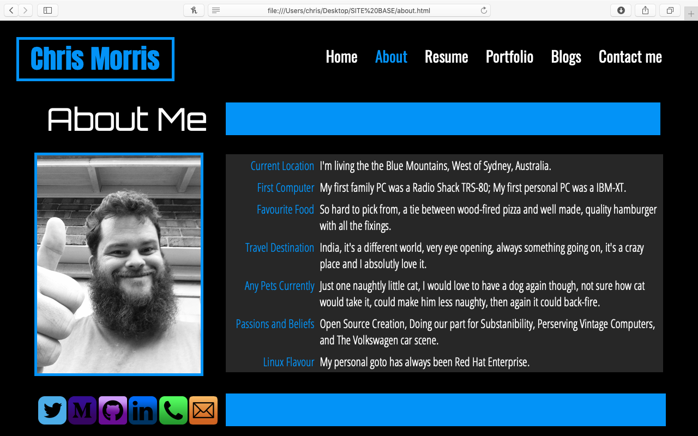
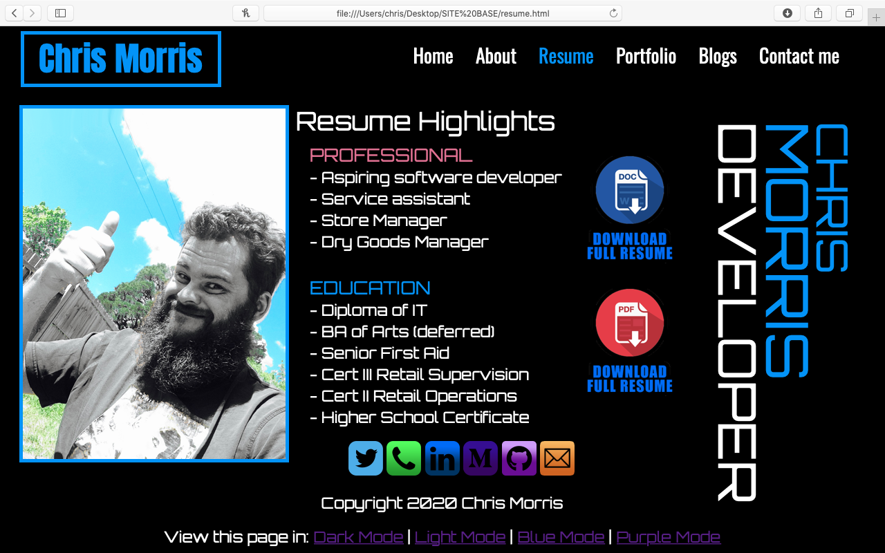
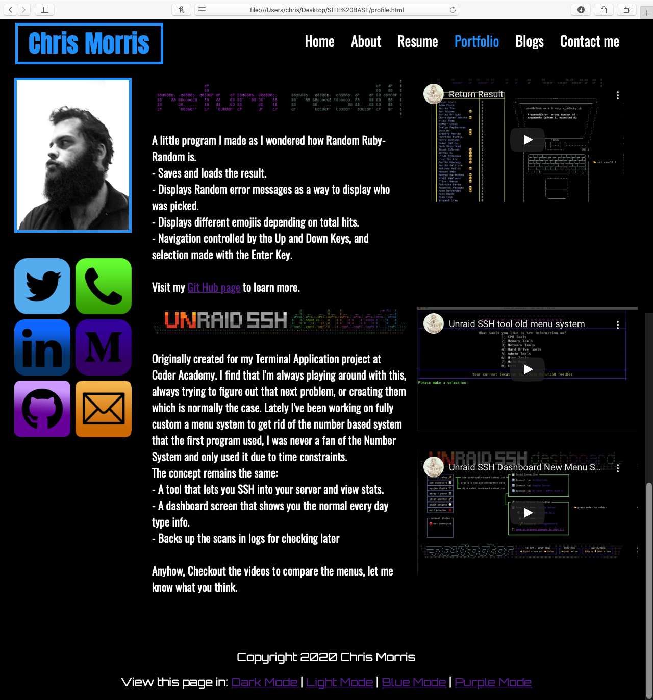
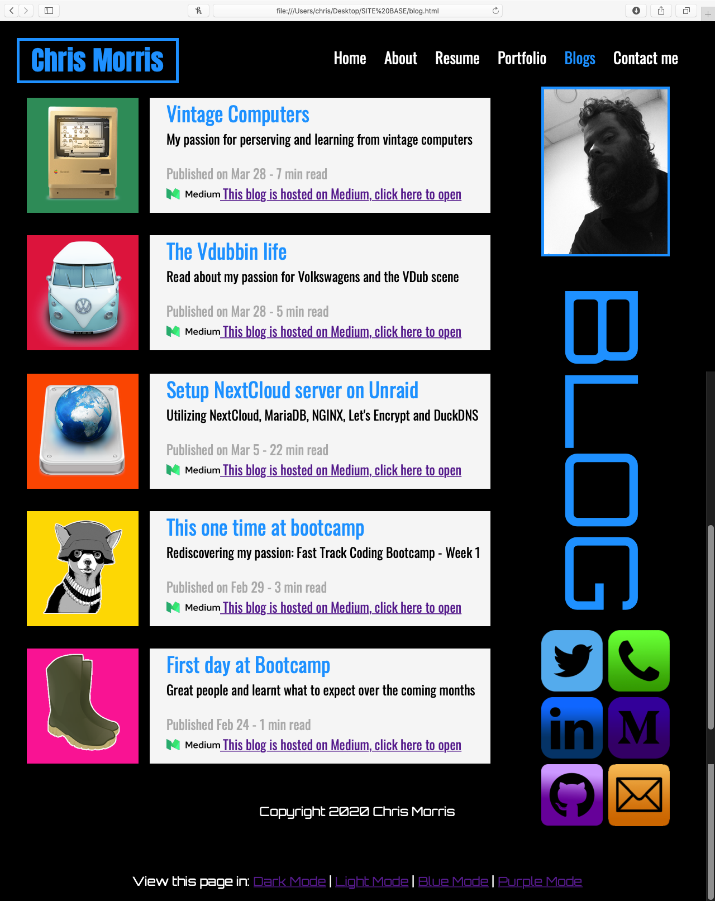
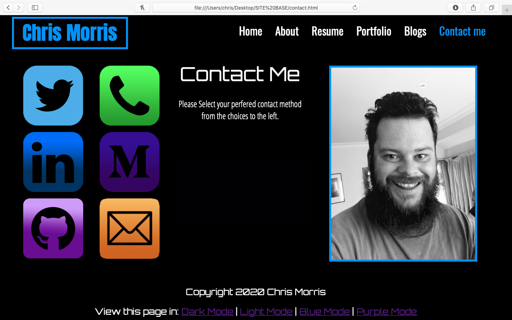
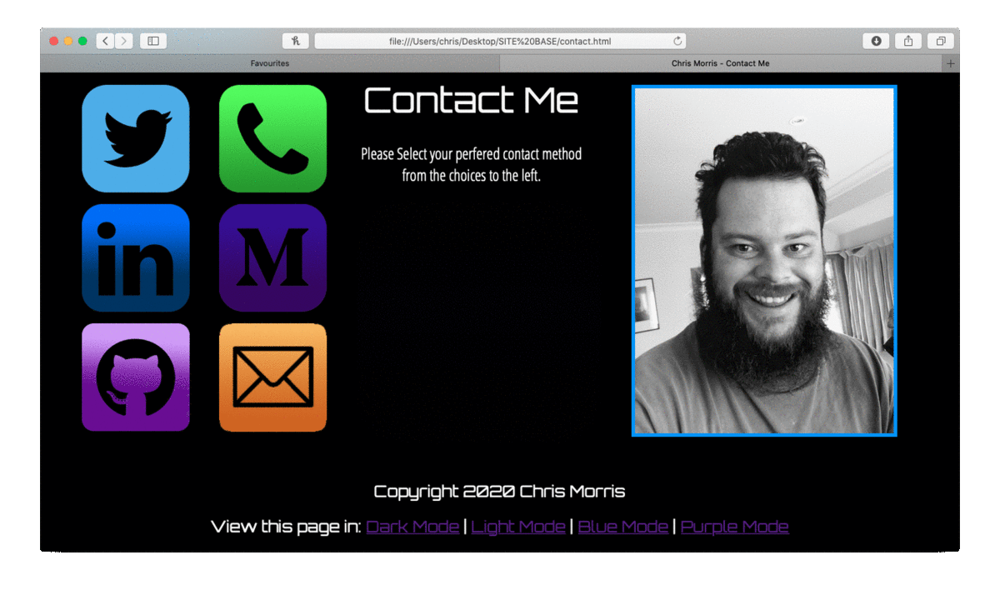

# Chris Morris Profile Page

## Purpose
This website purpose is to create a profile page about myself, telling the sites viewer:
- About me: a bit about me, my hobbies, my likes, pets etc
- Resume: My work history, education history and downloads for the full resume
- Portfolio: Showing examples of my work
- Blogs: Links to my blogs
- Contact me: So that the Viewer can contact me

## Functionality / features
### Navigation Bar
- My name to the top left, standing out as i'm selling myself
- Links to all other pages

### Home Page

- Writting that changes, that advertises what I can offer to the viewer
      -Starting text: "I CAN HELP YOU BUILD YOUR" then the Changing text
      -Changing text: "VISION", "CUSTOMERS", "TRAFFIC", "IMPACT", "RATING", "IMAGE", "PROFILE", "PROFIT"
- Icons of all the diferent methods that the viewer can contact me
      - Icons highlight white when hovered over
      - Icons designed by myself and are bright to highlight them
- Background image
      - This image background of me sets up the theme/mood of the page
         - Black image for dark mode
         - White image for light mode
         - Blue image for blue mode
         - Purple image for purple mode

### About page

- Picture of myself black and white
- General Information about myself, my likes, things I do and my hobbies 
- Again: Icons of all the diferent methods that the viewer can contact me
      - Icons highlight white when hovered over
      - Icons designed by myself and are bright to highlight them

### Resume Page

- Picture of myself, black and white but with a colour background to really stand out
- Highlights from my resume, professional and education
      - Hovering over the different points show a box with further information eg. hovering over 'Seinor first aid' gets a box displaying 'st johns ambulance', hover over 'aspiring software developer' a box displays 'Coder Academy 2020-Present'
- Images customised my myself to highlight the full resume download links, hovering over them gives them a white background and really highlights them
- Large sideways writting of my name 'chris' 'morris' and 'developer' to really stand out and sell myself
- and Again: Icons of all the diferent methods that the viewer can contact me
      - Icons highlight white when hovered over
      - Icons designed by myself and are bright to highlight them

### Portfolio

- Picture of myself, black and white
- Both examples of my work have headings of the logos used within the programs, the return results logo is animated like it is in the app
- 3 different embeded youtube videos of the applications being used, showing their features
- information and insight into both the applications
- and Again: Icons of all the diferent methods that the viewer can contact me
      - Icons highlight white when hovered over
      - Icons designed by myself and are bright to highlight them

### Blogs

- Picture of myself, black and white
- 'Blogs' written sideways in large font to sell the page
- All the blog information is seperated, with:
       - Large icons with bright backgrounds to really stand out the different entieries.
       - Large font of the blogs title
       - Brief description
       - Publish date and read time
       - A link to that particular blog
- and Again: Icons of all the diferent methods that the viewer can contact me
      - Icons highlight white when hovered over
      - Icons designed by myself and are bright to highlight them

### Contact me

- Large piture of myself
- Text informing the user to click on the icons for further information
- Icons of all the diferent methods that the viewer can contact me same as all other pages (highlight white when hovered over, designed bright to sell them) BUT this time a bit different:
      - Icons are much larger, supersized
      - Clicking on them brings up further information about that choice, such as:
            -Clicking twitter displays:
               - Large twitter logo
               - twitter Profile Name
               - Address to twitter profile
               - 3 Buttons designed by myself that highlight white on hover and when clicked will:
                  - Copy profile name to clipboard
                  - Copy URL to clipboard
                  - Open the URL

Sitemap
Screenshots
Target audience
Tech stack (e.g. html, css, deployment platform, etc)

