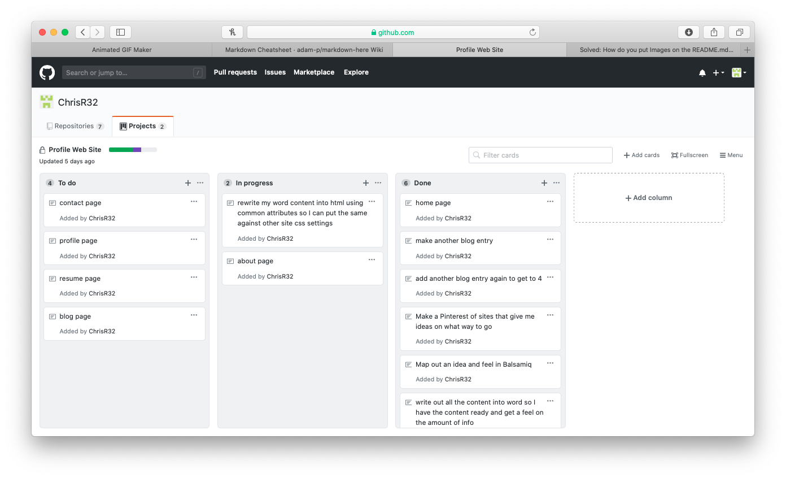

# Chris Morris Profile Page

## Purpose
This website purpose is to create a profile page about myself, telling the sites viewer:
- About 
: a bit about 
, my hobbies, my likes, pets etc
- Resume: My work history, education history and downloads for the full resume
- Portfolio: Showing examples of my work
- Blogs: Links to my blogs
- Contact 
: So that the Viewer can contact 

## Site-Map inc. Functionality / features
### Navigation Bar

1. My name to the top left, standing out as i'm selling myself
2. Links to all other pages

### Home Page

1. Writting that changes, that advertises what I can offer to the viewer
-Starting text: "I CAN HELP YOU BUILD YOUR" then the Changing text
-Changing text: "VISION", "CUSTOMERS", "TRAFFIC", "IMPACT", "RATING", "IMAGE", "PROFILE", "PROFIT"
2. Icons of all the diferent methods that the viewer can contact 

- Icons highlight white when hovered over
- Icons designed by myself and are bright to highlight them
3. Background image
- This image background of 
 sets up the theme/mood of the page
- Black image for dark mode
- White image for light mode
- Blue image for blue mode
- Purple image for purple mode

### About page

1. Picture of myself black and white
2. General Information about myself, my likes, things I do and my hobbies 
3. Again: Icons of all the diferent methods that the viewer can contact 

- Icons highlight white when hovered over
- Icons designed by myself and are bright to highlight them

### Resume Page

1. Picture of myself, black and white but with a colour background to really stand out
2. Highlights from my resume, professional and education
- Hovering over the different points show a box with further information eg. hovering over 'Seinor first aid' gets a box displaying 'st johns ambulance', hover over 'aspiring software developer' a box displays 'Coder Academy 2020-Present'
2. Images customised my myself to highlight the full resume download links, hovering over them gives them a white background and really highlights them
3. Large sideways writting of my name 'chris' 'morris' and 'developer' to really stand out and sell myself
4. and Again: Icons of all the diferent methods that the viewer can contact 

      - Icons highlight white when hovered over
      - Icons designed by myself and are bright to highlight them

### Portfolio

1. Picture of myself, black and white
2. examples of my work have headings of the logos used within the programs, the return results logo is animated like it is in the app
3. 3 different embeded youtube videos of the applications being used, showing their features
4. information and insight into both the applications
5. and Again: Icons of all the diferent methods that the viewer can contact 

      - Icons highlight white when hovered over
      - Icons designed by myself and are bright to highlight them

### Blogs

1. Picture of myself, black and white
2. 'Blogs' written sideways in large font to sell the page
3. All the blog information is seperated, with:
- Large icons with bright backgrounds to really stand out the different entieries.
- Large font of the blogs title
- Brief description
- Publish date and read time
- A link to that particular blog
4. and Again: Icons of all the diferent methods that the viewer can contact 

- Icons highlight white when hovered over
- Icons designed by myself and are bright to highlight them

### Contact 

1. Large piture of myself
2. Text informing the user to click on the icons for further information
3. Icons of all the diferent methods that the viewer can contact 
 same as all other pages (highlight white when hovered over, designed bright to sell them) BUT this time a bit different:
- Icons are much larger, supersized
- Clicking on them brings up further information about that choice.
4. eg Clicking twitter displays:
- Large twitter logo
- twitter Profile Name
- Address to twitter profile
5. 3 Buttons designed by myself that highlight white on hover and when clicked will:
- Copy profile name to clipboard
- Copy URL to clipboard
- Open the URL

### Mobile viewing
I dropped the ball here, I couldn't get flex box to work corectly and I thought mobile would work as I used CSS grid, but I think I over complicated the grids and the sites mobile viewing isn't good at all. Everything I tried to do to fix it created more problems and I think I would need to redesign it. So with the deadline nearing I kept the site how it was.

### Different Themes
I made 4 themes with seperate CSS files, I tried to have a bit of fun with this especially between light and dark. I didn't have enough time left to get the css to stick on all the pages after clicking the first time, so I placed links in the footers to change the seperate pages.

Dark Mode:

Light Mode:

Purple:

Blue:

## Wireframe
This is the wireframe I made at the start to give 
 an idea of how to plan, it also had pictures from things for ideas on the looks.

## Planning
Here are screenshots of my planning board:

## Resources

All images came from iconarchive, free to use for non-business, and were then customised by 

http://www.iconarchive.com/show/pretty-office-9-icons-by-custom-icon-design/email-send-icon.html

The following are the sites I used when I needed to work something out and they had the answer:

https://catswhocode.com/how-to-make-a-responsive-website/
https://www.w3schools.com/css/css_tooltip.asp
https://www.w3schools.com/css/tryit.asp?filename=trycss_tooltip
https://css-tricks.com/almanac/properties/v/vertical-align/
https://html-css-js.com/css/generator/border-outline/
https://codepen.io/GeorgePark/pen/EEGJEj
https://htmlcheatsheet.com/css/
https://www.w3schools.com/howto/howto_js_copy_clipboard.asp
https://webdev-il.blogspot.com/2011/03/how-to-make-html-link-to-call-phone.html
https://www.w3schools.com/css/css_form.asp
https://www.w3schools.com/howto/tryit.asp?filename=tryhow_js_toggle_hide_show
https://www.w3schools.com/css/css_form.asp
https://www.w3schools.com/howto/tryit.asp?filename=tryhow_js_toggle_hide_show
https://www.tutorialrepublic.com/faq/how-to-change-image-on-hover-with-css.php
https://speckyboy.com/css-javascript-text-animation-snippets/

## Deployment

Site is hosted on HostGator a web hosting service. I already had a subscription with them.

Sites domain name was also already owned by 
, owned for at least 10 years.

## SRI

The only thing I could find was the google fonts, it failed, spoke to Bruce who said there was an issue with SRI and google.

